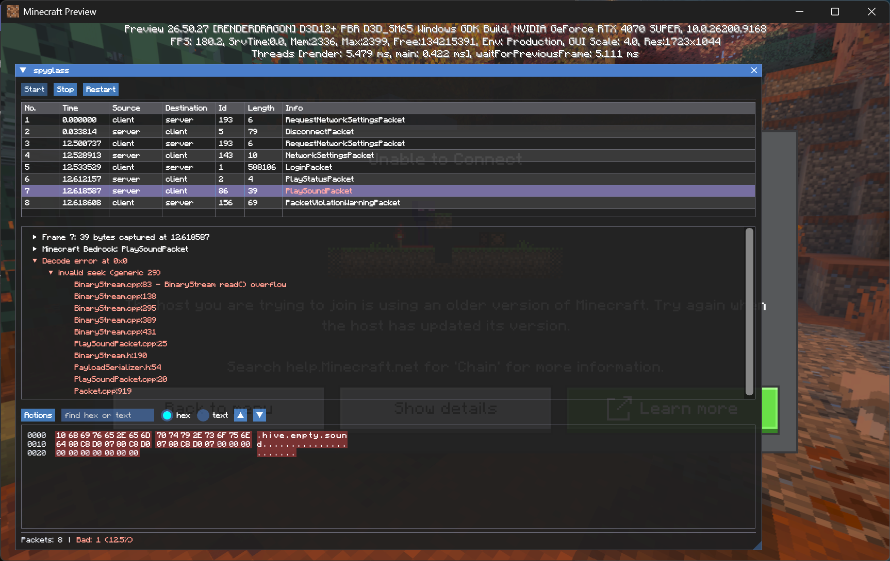

<div align="center">
  

<h3>Spyglass</h3>

<p>
  <b>A packet capture that runs inside the Minecraft: Bedrock client</b><br>
  Every packet the client sends and receives, and for the ones it fails to read, where it gave up and why
</p>

[](https://github.com/EndstoneMC/spyglass/actions/workflows/ci.yml)
[-black)](https://www.minecraft.net/en-us/download)
[](LICENSE)
[](https://discord.gg/xxgPuc2XN9)

</div>



## What you get

**List** — every packet of the session, oldest first: direction, id, length, name. Follows the tail until you scroll
away from it. Failed decodes are coloured.

**Details** — the frame, the packet, and the fields it decoded to, with names, values, enum names and nesting from
the client's own cereal reflection. A field holding NBT opens as a tag tree. On a failure, the error the client
raised, the fields it managed before it stopped, and the Bedrock call stack under it, down to file and line.

**Bytes** — the body as one hex run, with the part the decode never reached tinted. Select a range by click, drag
and shift-click in either half, search it for hex or text with `Ctrl+F` and `F3`, and copy as a hex dump, a hex
stream, printable text, a C array or base64. `Show text...` puts the same output in a box instead of on the
clipboard.

**Filter**, on the toolbar — every packet the client knows, by id, each with a tick box and a seen count. A find box
that `All`, `None` and `Invert` act through, `Failed decodes only`, and a box per direction. Right-clicking a packet
in the list hides it or shows only it. The button carries a mark while a filter is on.

**Capture** — `Start`, `Stop` and `Restart`. Sent packets as well as received ones, no length limit, and temporary:
it goes when the client does, and one left behind by a crashed client is cleaned up on the next inject. `Capture ▸
Options` sets the memory it may use and turns off capturing sent packets. The status bar carries the totals, the
share that failed, the extent of the selection, how many packets are shown, the size of the capture, and how many
packets were dropped rather than allowed to hold the game up.

**Menus**, with nothing bound to a key:

- `Go` — a packet by number, the first or last, the next failed decode, the next of the same kind, and back and
  forward through the ones you have looked at.
- `Edit` — find by name, by id, or by hex or text in the body; mark packets; set the zero of the clock; copy the
  row, the details tree, or every displayed row as text or CSV.
- `View` — hide panes, zoom, expand the tree, turn the colouring off, fit the columns, open a packet in its own
  window, and set what `Time` means: since the first packet, the previous captured one, the previous displayed one,
  or the time of day.
- `Analyze` — failed decodes grouped by the reason the client gave and the packet it was reading, click to jump; and
  the selected bytes read out as an integer, a float, a varint and text.
- `Statistics` — what the session captured, a per-id breakdown with its share of the bytes, the distribution of
  packet lengths, and a graph of packets or bytes per second.
- `File` — `Export Packets...` as text, CSV or JSON: all of them, the selected one, the marked ones or a range,
  against everything captured or only what the filter shows, with the summary line, the details tree and the bytes
  in any combination. It counts and estimates the size first, then runs behind a progress bar you can cancel,
  without stopping the game. `Export Selected Packet Bytes...` writes the selected range raw, the whole body when
  nothing is selected. `Export Session Summary...` writes the totals.

The save dialog starts in `%LOCALAPPDATA%\spyglass`, or `~/.local/share/spyglass` on the Linux launcher, lists the
directory it is in, takes a path typed in full, and says so before it overwrites a file.

## Quick Start

### Windows

Unpack `spyglass-vX.Y.Z-windows-x64.zip` from the
[releases](https://github.com/EndstoneMC/spyglass/releases), or build it yourself below. Start Minecraft, then run
the injector beside the DLL:

```shell
spyglass.exe
```

It asks for administrator rights, and the elevated run carries on in a window of its own.

The zip holds one DLL per client build. The injector reads the running client's version and whether it is the
preview one, and loads the newest payload beside it that does not sit above that version, so
`spyglass-0.3.0-1.26.40.dll` also serves a 1.26.45 release client while `spyglass-0.3.0-1.26.60.preview.dll` serves
a 1.26.60 preview. A payload you built for some other version is picked up the same way if you drop it in beside the
others.

| option | |
| --- | --- |
| `--dll <path>` | a payload of your choosing, instead of the one the version match would pick |
| `--process <name>` | a client process other than `Minecraft.Windows.exe` |

Press **F12** in game for the overlay. It takes the mouse only while the game has let go of the cursor and the
pointer is over the overlay, so mouse-look keeps working underneath an overlay left open during play.

### Linux

There the game runs under the
[Minecraft Bedrock Launcher](https://github.com/minecraft-linux/mcpelauncher-manifest), which loads shared objects
as mods, so there is no injector and nothing to elevate. Unpack `spyglass-vX.Y.Z-linux-x64.zip` from the
[releases](https://github.com/EndstoneMC/spyglass/releases), or build it yourself below, then put the shared object
where the launcher looks, named for the client your launcher runs:

```shell
install -D libspyglass-0.3.0-1.26.40.so ~/.local/share/mcpelauncher/mods/spyglass/0.3.0/x86_64/libspyglass.so
```

Write a `mod.json` beside it naming the mod:

```json
{ "name": "spyglass", "version": "0.2.0", "arch": "x86_64" }
```

Then add that directory under `Mods` in the profile you play, and start the game.

The overlay key is **F12**, the same as on Windows.

## Building from Source

Both platforms build through `CMakePresets.json`. Dependencies are fetched during configure, so there is nothing to
install first.

### Windows

Needs clang-cl and lld-link (LLVM 18+, the "C++ Clang tools for Windows" component of Visual Studio), the MSVC
toolchain for the Windows SDK and STL, CMake 3.28+ and Ninja. Run it from a Developer prompt.

```shell
cmake --preset relwithdebinfo-windows
cmake --build --preset relwithdebinfo-windows
```

`spyglass.exe` and one DLL per client build land in `build/relwithdebinfo-windows`.

### Linux launcher mod

The launcher mod is an Android x86_64 shared object. Needs the Android NDK with `ANDROID_NDK_ROOT` set, CMake 3.28+
and Ninja. The Android presets hide themselves when that variable is unset, and the Windows presets hide themselves
off a Windows host.

```shell
cmake --preset relwithdebinfo-android
cmake --build --preset relwithdebinfo-android
```

One shared object per client build lands in `build/relwithdebinfo-android`.

`release-windows`, `release-android` and `debug-android` configure the same way. CI builds the `relwithdebinfo`
preset for each platform and uploads what `cmake --install` stages.

### Targeting another client

`MINECRAFT_CLIENTS` is the list of client builds a configure produces a payload for, one target each. The default is
what CI ships, and any four-component version works, with `-preview` on the ones that are:

```shell
cmake --preset relwithdebinfo-windows -D MINECRAFT_CLIENTS="1.26.40.5;1.26.60.21-preview"
```

A version no pattern set covers fails the build rather than producing a payload that would not work.

## Client Versions

| payload | client builds |
| --- | --- |
| `spyglass-0.3.0-1.26.40.dll` | Windows release 1.26.40.5, 1.26.44.3, 1.26.45.1 |
| `spyglass-0.3.0-1.26.50.preview.dll` | Windows preview 1.26.50.27 |
| `spyglass-0.3.0-1.26.60.preview.dll` | Windows preview 1.26.60.21 |
| `libspyglass-0.3.0-1.26.40.so` | Android x86_64 1.26.4x, for the Linux launcher |

A payload is built for one client line, release or preview, and the two preview payloads are not interchangeable. On
Windows the injector picks the matching one; on Linux you name it yourself. A payload loaded into a client it was
not built for installs nothing and says so in the errors window, which is also where the reason is if the packet
count stays at zero while you are connected.

A payload is not tied to a single build, and in practice covers the builds of a line, but a client update can still
need it refreshed.

## Caveats

- Reports are only as good as the reasons the client gives, which vary by packet.
- On Windows the overlay draws over Direct3D 11 and 12, and no other rendering path is supported. On Linux it is
  drawn by the launcher's own ImGui, and is left out when the two ImGui revisions disagree.
- A stripped launcher gets no overlay.
- A client update that adds a source file renders its call stack frames as `<hash>:line` until a line for it is
  added to the filename table.
- The capture contains packet contents from whatever server you are connected to, including whatever you logged in
  with. Nothing is sanitised, and an export writes it to disk in the clear, so read a file before you share it.

## License

MIT, see [LICENSE](LICENSE).
